```mermaid
sequenceDiagram
    participant Student as Student Frontend
    participant API as Backend API
    participant DB as MongoDB
    
    Student->>API: GET /api/courses?status=PUBLISHED
    API-->>Student: 200 OK<br/>Lista de cursos públicos
    
    Student->>API: GET /api/courses/{slug}
    API-->>Student: 200 OK<br/>Detalles del curso
    
    Note over Student: Usuario decide inscribirse
    
    Student->>API: POST /api/enrollments<br/>{course_id}
    API->>DB: Verificar si ya está inscrito
    API->>DB: Crear Enrollment<br/>expires_at = +1 año
    API-->>Student: 201 Created<br/>{enrollment_id, expires_at}
    
    Student->>API: GET /api/enrollments/me
    API-->>Student: 200 OK<br/>Mis cursos inscritos
    
    Student->>API: GET /api/courses/{course_id}/lessons
    API-->>Student: 200 OK<br/>Lista de lecciones ordenadas
    
    loop Mientras ve el video
        Student->>API: PATCH /api/enrollments/{id}/progress<br/>{lesson_id, position_seconds}
        API->>DB: Actualizar progreso
        API-->>Student: 200 OK
    end
    
    Note over Student: Completa todas las lecciones
    Student->>API: PATCH /api/enrollments/{id}/progress<br/>{completed: true}
    API->>DB: Marcar completed_at
    API-->>Student: 200 OK<br/>{certificate_url}
```

```mermaid
sequenceDiagram
    participant Admin as Admin Frontend
    participant API as Backend API
    
    Admin->>API: GET /api/courses/{course_id}/lessons
    API-->>Admin: 200 OK<br/>Lista ordenada actual
    
    Note over Admin: Editar lección 2
    
    Admin->>API: PUT /api/lessons/{lesson_id}<br/>{summary, duration_seconds}
    API-->>Admin: 200 OK<br/>Lección actualizada
    Note over API: Auto-recalcula total_duration_hours
    
    Note over Admin: Mover lección 5 a posición 2
    
    Admin->>API: PATCH /api/lessons/{lesson_id}/order<br/>{order: 2}
    API-->>Admin: 200 OK<br/>Array completo reordenado
    Note over API: Lecciones 2,3,4 se mueven a 3,4,5
```

# 04 - Flujos de Negocio y Casos de Uso

## Introducción
Este documento describe **cómo usar los endpoints en secuencia** para completar tareas de negocio reales.
**Objetivo:** Ayudar a la IA del frontend a entender el "flujo completo" de interacciones con el backend.

---

## 🔑 Flujo 1: Autenticación y Obtener Perfil

### Caso de Uso
Un usuario entra a la aplicación y necesita iniciar sesión para acceder a su contenido.

### Diagrama de Secuencia


### Pasos Detallados

1. **Login Inicial**
   - Frontend envía credenciales a `POST /api/auth/login`
   - Backend valida contraseña y genera JWT
   - Frontend recibe `access_token` y datos básicos del usuario
   - **Guardar token** en `localStorage` o `sessionStorage`

2. **Obtener Perfil Completo** (Opcional)
   - Frontend llama `GET /api/auth/me` con el token
   - Útil para obtener datos frescos del usuario al recargar la página

3. **Manejo de Errores**
   - `401` → Redirigir a página de login
   - `422` → Mostrar errores de validación en formulario

---

## 📚 Flujo 2: Crear Curso Completo (Admin)

### Caso de Uso
Un administrador crea un curso nuevo con lecciones y materiales.

### Diagrama de Secuencia


### Pasos Detallados

1. **Crear Curso Base**
   - `POST /api/courses` con datos mínimos (título, descripción, precio)
   - Backend genera `slug` automáticamente
   - Estado inicial: `DRAFT`
   - **Guardar `course_id`** para los siguientes pasos

2. **Subir Portada**
   - Frontend sube la imagen a Cloudinary directamente (opcional)
   - O envía a `PATCH /api/courses/{id}/cover`
   - Backend sube a Cloudinary y actualiza la URL

3. **Agregar Lecciones**
   - **Importante:** Subir video a Bunny.net PRIMERO (fuera del backend)
   - Obtener `video_url` y `video_id` de Bunny
   - Crear lección con `POST /api/courses/{id}/lessons`
   - El campo `order` se asigna automáticamente (1, 2, 3...)
   - Backend actualiza `lessons_count` y `total_duration_hours` del curso

4. **Agregar Materiales** (Opcional)
   - Subir archivos con `POST /api/lessons/{lesson_id}/materials`
   - Backend sube a Cloudinary automáticamente

5. **Publicar Curso**
   - Cambiar estado a `PUBLISHED` con `PATCH /api/courses/{id}/status`
   - Ahora es visible para estudiantes en el catálogo

### Errores Comunes
- `422` - Descripción muy corta (mín 20 caracteres)
- `403` - Usuario no es Admin

---

## 🎯 Flujo 3: Estudiante Inscribe y Toma Curso

### Caso de Uso
Un estudiante navega el catálogo, se inscribe a un curso y comienza a verlo.

### Diagrama de Secuencia



### Pasos Detallados

1. **Explorar Catálogo**
   - `GET /api/courses?status=PUBLISHED` para ver cursos disponibles
   - Filtrar por `category`, `difficulty`, `search`
   - Ver detalles con `GET /api/courses/{slug}`

2. **Inscribirse al Curso**
   - **IMPORTANTE:** La inscripción la hace un ADMIN con `POST /api/enrollments`
   - El estudiante NO puede auto-inscribirse (por seguridad)
   - El admin recibe el pago fuera del sistema y crea el enrollment manualmente
   - El enrollment expira automáticamente en 1 año

3. **Ver Mis Cursos Inscritos**
   - `GET /api/enrollments/me` lista los cursos activos del usuario
   - Incluye progreso, fecha de expiración, etc.

4. **Ver Lecciones del Curso**
   - `GET /api/courses/{course_id}/lessons` devuelve lecciones ordenadas por `order`
   - Si `is_preview: true`, el video es visible sin inscripción

5. **Guardar Progreso (Continuar Viendo)**
   - **Cada 10-30 segundos** durante la reproducción del video
   - Frontend envía `PATCH /api/enrollments/{id}/progress`
   - Backend guarda `last_accessed_lesson_id` y `last_video_position_seconds`
   - Al volver, el frontend puede resumir desde esa posición

6. **Completar Curso** (Futuro)
   - Cuando el estudiante completa todas las lecciones
   - Backend marca `completed_at` y puede generar certificado

### Errores Comunes
- `400` - Ya inscrito activamente
- `403` - Enrollment expirado
- `404` - Curso no encontrado

---

## 🔧 Flujo 4: Editar y Reordenar Lecciones (Admin)

### Caso de Uso
Un admin necesita corregir información de una lección o cambiar el orden.

### Diagrama de Secuencia



### Pasos Detallados

1. **Actualizar Datos de Lección**
   - `PUT /api/lessons/{id}` con campos a modificar
   - **Efecto:** Si cambias `duration_seconds`, el curso padre recalcula `total_duration_hours`

2. **Reordenar Lecciones**
   - Frontend muestra drag-and-drop
   - Envía `PATCH /api/lessons/{id}/order` con el nuevo `order`
   - Backend reordena TODAS las lecciones automáticamente
   - Devuelve el array completo actualizado para re-renderizar

3. **Eliminar Lección**
   - `DELETE /api/lessons/{id}`
   - Backend elimina y reordena las restantes (1, 2, 3...)
   - Recalcula estadísticas del curso padre

---

## 👥 Flujo 5: Gestión de Usuarios (Admin)

### Caso de Uso
Un admin crea un nuevo usuario y gestiona su perfil.

### Diagrama de Secuencia


### Jerarquía de Permisos

| Admin Tipo | Puede Crear | Puede Editar |
| :--- | :--- | :--- |
| **SUPERADMIN** | ADMIN, MODERATOR, USER | Todos |
| **ADMIN** | MODERATOR, USER | MODERATOR, USER |

---

## 🎓 Resumen de Patrones Clave

### 1. Autenticación en Todos los Requests Protegidos
```javascript
headers: {
  'Authorization': `Bearer ${token}`,
  'Content-Type': 'application/json'
}
```

### 2. Manejo de Errores Consistente
```javascript
try {
  const response = await fetch('/api/endpoint');
  if (response.status === 401) {
    // Token expirado → Redirigir a login
    redirectToLogin();
  }
  if (response.status === 403) {
    // Sin permisos → Mostrar mensaje
    showError('No tienes permisos');
  }
  if (response.status === 422) {
    // Validación → Mostrar errores en formulario
    const errors = await response.json();
    displayValidationErrors(errors.detail);
  }
} catch (error) {
  showError('Error de conexión');
}
```

### 3. Paginación Estándar
Todos los endpoints de listado usan:
```javascript
const params = new URLSearchParams({
  page: 1,
  limit: 10,  // o per_page/size según endpoint
  search: 'query'
});
```

### 4. Subida de Archivos (Multipart)
```javascript
const formData = new FormData();
formData.append('file', fileInput.files[0]);
formData.append('title', 'Nombre archivo');

fetch('/api/lessons/{id}/materials', {
  method: 'POST',
  headers: { 'Authorization': `Bearer ${token}` },
  body: formData  // NO enviar Content-Type, el browser lo maneja
});
```

### 5. Actualización de Progreso en Background
```javascript
let progressInterval;

function startVideoProgressTracking(enrollmentId, lessonId) {
  progressInterval = setInterval(() => {
    const position = videoPlayer.currentTime;
    updateProgress(enrollmentId, lessonId, position);
  }, 15000);  // Cada 15 segundos
}

function stopVideoProgressTracking() {
  clearInterval(progressInterval);
}
```

---

**Fin de los flujos de negocio**
